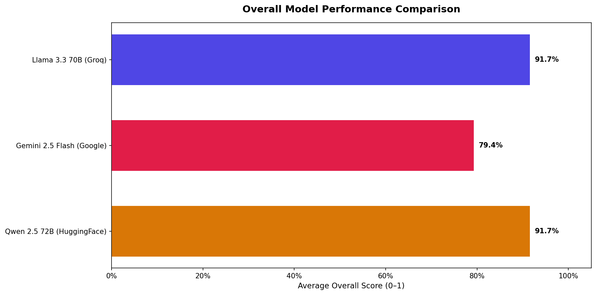
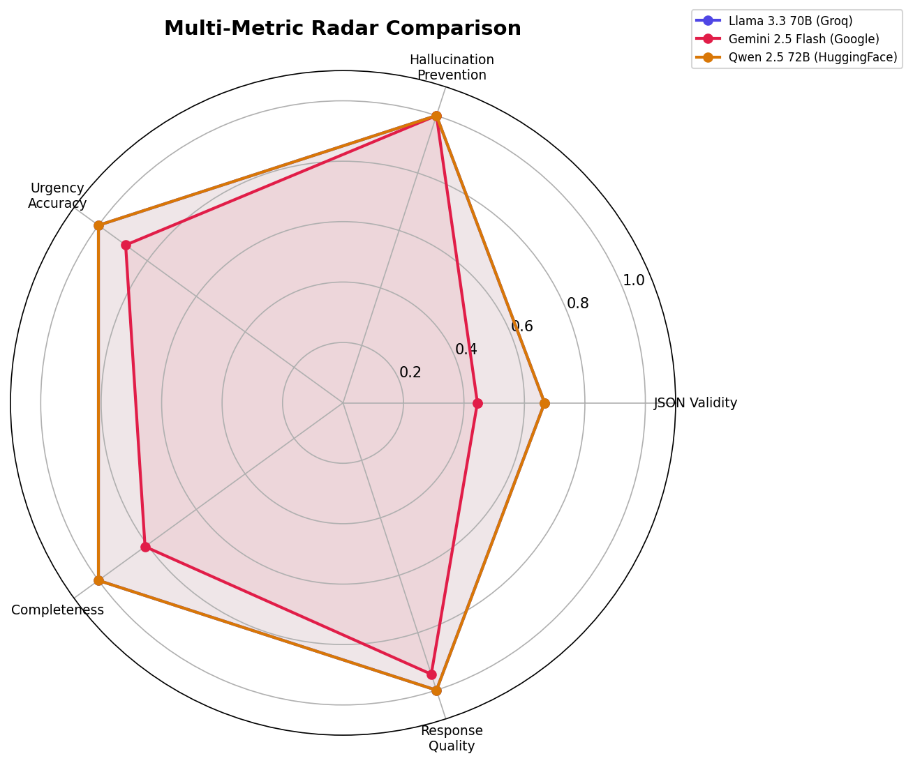
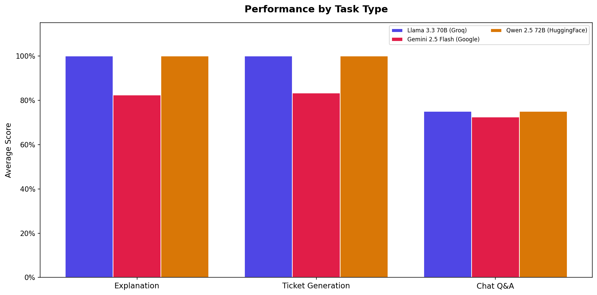

# LUMIN.AI – Comparative Analysis / Ablation Study

## Executive Summary

This report compares **3** LLM models across **3 task types** (explanation, ticket generation, chat) and **3 risk scenarios** (no_risk, degradation_risk, shutdown_risk) for the LUMIN.AI solar-plant diagnostic use case.

### Evaluation Criteria

| Metric | Weight | Description |
|--------|--------|-------------|
| JSON Validity | 25% | Produces valid JSON with all required schema fields |
| Hallucination Prevention | 25% | Only references provided sensor data and SHAP features |
| Urgency Accuracy | 10% | Assigns correct urgency level for risk class |
| Technical Completeness | 25% | Includes all required technical details |
| Response Quality | 15% | Appropriate length, no refusals, coherent output |

---

## Overall Rankings

| Rank | Model | Overall Score | Avg Latency | JSON Rate | Halluc. Score |
|------|-------|--------------|-------------|-----------|---------------|
| 1 | Llama 3.3 70B (Groq) | 91.7% | 1.0s | 67% | 100% |
| 2 | Qwen 2.5 72B (HuggingFace) | 91.7% | 21.2s | 67% | 100% |
| 3 | Gemini 2.5 Flash (Google) | 79.4% | 8.8s | 44% | 100% |

---

## Per-Task Breakdown

### Explanation Task

| Model | Score | Latency |
|-------|-------|---------|
| Llama 3.3 70B (Groq) | 100.0% | 1.2s |
| Qwen 2.5 72B (HuggingFace) | 100.0% | 28.0s |
| Gemini 2.5 Flash (Google) | 82.4% | 10.5s |

### Ticket Task

| Model | Score | Latency |
|-------|-------|---------|
| Llama 3.3 70B (Groq) | 100.0% | 1.3s |
| Qwen 2.5 72B (HuggingFace) | 100.0% | 26.8s |
| Gemini 2.5 Flash (Google) | 83.3% | 10.1s |

### Chat Task

| Model | Score | Latency |
|-------|-------|---------|
| Llama 3.3 70B (Groq) | 75.0% | 0.6s |
| Qwen 2.5 72B (HuggingFace) | 75.0% | 8.8s |
| Gemini 2.5 Flash (Google) | 72.5% | 6.0s |

---

## Detailed Metric Scores

| Model | JSON | Hallucination | Urgency | Completeness | Quality |
|-------|------|---------------|---------|--------------|---------|
| Llama 3.3 70B (Groq) | 67% | 100% | 100% | 100% | 100% |
| Qwen 2.5 72B (HuggingFace) | 67% | 100% | 100% | 100% | 100% |
| Gemini 2.5 Flash (Google) | 44% | 100% | 89% | 81% | 94% |

---

## Graphs

---

## Recommendation

Based on the ablation study, **Llama 3.3 70B (Groq)** achieves the highest overall score of **91.7%** across all evaluation criteria.

The runner-up is **Qwen 2.5 72B (HuggingFace)** with **91.7%**.

For latency-sensitive deployments, **Llama 3.3 70B (Groq)** offers the fastest response time at **1.0s** average.

---

*Report generated automatically by LUMIN.AI Ablation Study Framework*